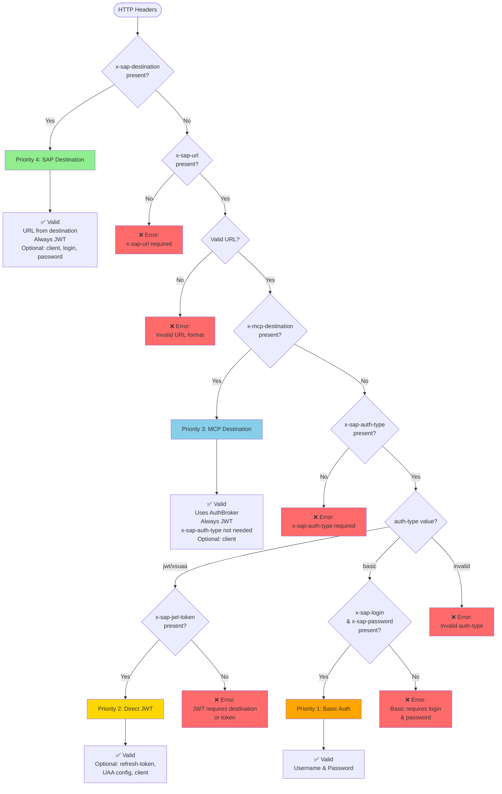

# Architecture

## Overview

The header validator implements a priority-based authentication system for MCP ABAP ADT servers. It validates HTTP headers and determines the appropriate authentication method based on header presence and priority rules.

## Priority Flow Diagram



## Header Composition Matrix

| Priority | Method | Required Headers | Optional Headers | URL Source |
|----------|--------|------------------|------------------|------------|
| **4** | SAP Destination | `x-sap-destination` | `x-sap-client`<br/>`x-sap-login`<br/>`x-sap-password` | From destination<br/>(service key/.env) |
| **3** | MCP Destination | `x-mcp-destination` | `x-sap-client` | From destination<br/>(service key/.env) |
| **2** | Direct JWT | `x-sap-url`<br/>`x-sap-auth-type: jwt/xsuaa`<br/>`x-sap-jwt-token` | `x-sap-refresh-token`<br/>`x-sap-uaa-url`<br/>`x-sap-uaa-client-id`<br/>`x-sap-uaa-client-secret`<br/>`x-sap-client` | From header<br/>(`x-sap-url`) |
| **1** | Basic | `x-sap-url`<br/>`x-sap-auth-type: basic`<br/>`x-sap-login`<br/>`x-sap-password` | - | From header<br/>(`x-sap-url`) |

## Priority System

Authentication methods are evaluated in the following priority order (highest to lowest):

### 1. SAP Destination-Based (Priority 4) - Highest

**Header**: `x-sap-destination`

**Characteristics**:
- Does NOT require `x-sap-auth-type` (always uses JWT)
- Uses AuthBroker to manage tokens
- Tokens loaded from `{destination}.env` files
- Automatic token validation and refresh

**Required Headers**:
- `x-sap-destination` - Destination name (e.g., "S4HANA_E19")

**Optional Headers**:
- `x-sap-client` - SAP client number
- `x-sap-login` - Username (for cloud systems)
- `x-sap-password` - Password (for cloud systems)

**Important**: 
- `x-sap-url` is **NOT required** - URL is loaded from destination (service key or .env file)
- If `x-sap-url` is provided, it will be ignored (warning issued)

**Example**:
```typescript
{
  'x-sap-destination': 'S4HANA_E19',
  'x-sap-client': '100', // optional
  'x-sap-login': 'user', // optional (for cloud)
  'x-sap-password': 'pass', // optional (for cloud)
}
// Note: x-sap-url not needed - URL comes from destination
```

### 2. MCP Destination-Based (Priority 3)

**Header**: `x-mcp-destination`

**Characteristics**:
- Does NOT require `x-sap-auth-type` (always uses JWT)
- Uses AuthBroker to manage tokens
- Tokens loaded from `{destination}.env` files
- Automatic token validation and refresh

**Required Headers**:
- `x-mcp-destination` - Destination name

**Optional Headers**:
- `x-sap-client` - SAP client number

**Important**: 
- `x-sap-url` is **NOT required** - URL is loaded from destination (service key or .env file)
- If `x-sap-url` is provided, it will be ignored (warning issued)
- `x-sap-auth-type` is **NOT required** - always uses JWT
- If `x-sap-auth-type` is provided, it will be ignored (warning issued)

**Example**:
```typescript
{
  'x-mcp-destination': 'TRIAL',
  // Note: x-sap-url not needed - URL comes from destination
  // Note: x-sap-auth-type not needed - always JWT
}
```

### 3. Direct JWT (Priority 2)

**Header**: `x-sap-jwt-token`

**Characteristics**:
- Requires `x-sap-auth-type: jwt` or `xsuaa`
- Token provided directly in headers
- No AuthBroker dependency

**Required Headers**:
- `x-sap-url` - SAP system URL
- `x-sap-auth-type` - Must be `jwt` or `xsuaa`
- `x-sap-jwt-token` - JWT access token

**Optional Headers**:
- `x-sap-refresh-token` - Refresh token
- `x-sap-uaa-url` / `uaa-url` - UAA URL
- `x-sap-uaa-client-id` / `uaa-client-id` - UAA Client ID
- `x-sap-uaa-client-secret` / `uaa-client-secret` - UAA Client Secret
- `x-sap-client` - SAP client number

**Example**:
```typescript
{
  'x-sap-url': 'https://test.sap.com',
  'x-sap-auth-type': 'jwt',
  'x-sap-jwt-token': 'eyJhbGciOiJSUzI1NiIsInR5cCI6IkpXVCJ9...',
  'x-sap-refresh-token': 'refresh_token', // optional
  'x-sap-uaa-url': 'https://uaa.test.com', // optional
}
```

### 4. Basic Authentication (Priority 1) - Lowest

**Headers**: `x-sap-login` + `x-sap-password`

**Characteristics**:
- Requires `x-sap-auth-type: basic`
- Username/password authentication
- Used for on-premise systems

**Required Headers**:
- `x-sap-url` - SAP system URL
- `x-sap-auth-type` - Must be `basic`
- `x-sap-login` - Username
- `x-sap-password` - Password

**Example**:
```typescript
{
  'x-sap-url': 'https://test.sap.com',
  'x-sap-auth-type': 'basic',
  'x-sap-login': 'username',
  'x-sap-password': 'password',
}
```

## Valid Header Combinations

### ✅ Valid Combinations

#### 1. SAP Destination (Simplest)
```typescript
{
  'x-sap-destination': 'S4HANA_E19',
}
// No x-sap-url needed - URL from destination
// No x-sap-auth-type needed - always JWT
```

#### 2. MCP Destination
```typescript
{
  'x-sap-url': 'https://test.sap.com',
  'x-mcp-destination': 'TRIAL',
  // Note: x-sap-auth-type not needed - always JWT
}
```

#### 3. Direct JWT
```typescript
{
  'x-sap-url': 'https://test.sap.com',
  'x-sap-auth-type': 'jwt',
  'x-sap-jwt-token': 'eyJhbGciOiJSUzI1NiIsInR5cCI6IkpXVCJ9...',
}
```

#### 4. Basic Auth
```typescript
{
  'x-sap-url': 'https://test.sap.com',
  'x-sap-auth-type': 'basic',
  'x-sap-login': 'user',
  'x-sap-password': 'pass',
}
```

### ⚠️ Conflicting Combinations (Warnings Issued)

#### 1. SAP Destination + Auth Type
```typescript
{
  'x-sap-url': 'https://test.sap.com',
  'x-sap-destination': 'S4HANA_E19',
  'x-sap-auth-type': 'jwt', // Warning: ignored
}
// Result: SAP Destination used (Priority 4)
```

#### 2. Destination + Direct JWT Token
```typescript
{
  'x-sap-url': 'https://test.sap.com',
  'x-sap-destination': 'S4HANA_E19',
  'x-sap-jwt-token': 'token', // Warning: ignored
}
// Result: SAP Destination used (Priority 4)
```

#### 4. Multiple Destinations
```typescript
{
  'x-sap-url': 'https://test.sap.com',
  'x-sap-destination': 'S4HANA_E19', // Priority 4
  'x-mcp-destination': 'TRIAL', // Priority 3 - ignored
}
// Result: x-sap-destination used
```

### ❌ Invalid Combinations

#### 1. Missing Required Headers
```typescript
{
  'x-sap-url': 'https://test.sap.com',
  // Missing x-sap-auth-type or x-sap-destination
}
// Error: x-sap-auth-type header is required when x-sap-destination is not present
```

#### 2. Invalid Auth Type
```typescript
{
  'x-sap-url': 'https://test.sap.com',
  'x-sap-auth-type': 'invalid',
}
// Error: x-sap-auth-type must be one of: jwt, xsuaa, basic
```

#### 3. JWT Without Token or Destination
```typescript
{
  'x-sap-url': 'https://test.sap.com',
  'x-sap-auth-type': 'jwt',
  // Missing both x-sap-destination, x-mcp-destination, and x-sap-jwt-token
}
// Error: JWT authentication requires either x-sap-destination, x-mcp-destination, or x-sap-jwt-token header
```

#### 4. Basic Auth Without Credentials
```typescript
{
  'x-sap-url': 'https://test.sap.com',
  'x-sap-auth-type': 'basic',
  // Missing x-sap-login and/or x-sap-password
}
// Error: Basic authentication requires x-sap-login and x-sap-password headers
```

## Priority Resolution Algorithm

1. **Check for `x-sap-destination`** (Priority 4)
   - If present → Use SAP Destination auth (always JWT)
   - Ignore all other auth headers (warnings issued)

2. **Check for `x-sap-auth-type`**
   - If missing and no `x-sap-destination` → Error
   - If present → Continue to step 3

3. **Check for `x-mcp-destination`** (Priority 3)
   - If present and `auth-type` is `jwt`/`xsuaa` → Use MCP Destination auth
   - Ignore direct JWT token (warning issued)

4. **Check for `x-sap-jwt-token`** (Priority 2)
   - If present and `auth-type` is `jwt`/`xsuaa` → Use Direct JWT auth

5. **Check for `x-sap-login` + `x-sap-password`** (Priority 1)
   - If present and `auth-type` is `basic` → Use Basic auth

6. **No valid method found** → Return error

## Design Decisions

### Why Two Destination Headers?

- **`x-sap-destination`**: Simplified API - no auth-type needed, always JWT
- **`x-mcp-destination`**: Explicit auth-type control, backward compatibility

### Why Priority System?

Allows flexible header combinations while ensuring predictable behavior:
- Higher priority methods take precedence
- Warnings issued for ignored headers
- Clear error messages for invalid combinations

### Why Validate Early?

Early validation prevents:
- Invalid configurations reaching the server
- Confusion about which auth method is used
- Security issues from misconfigured headers

