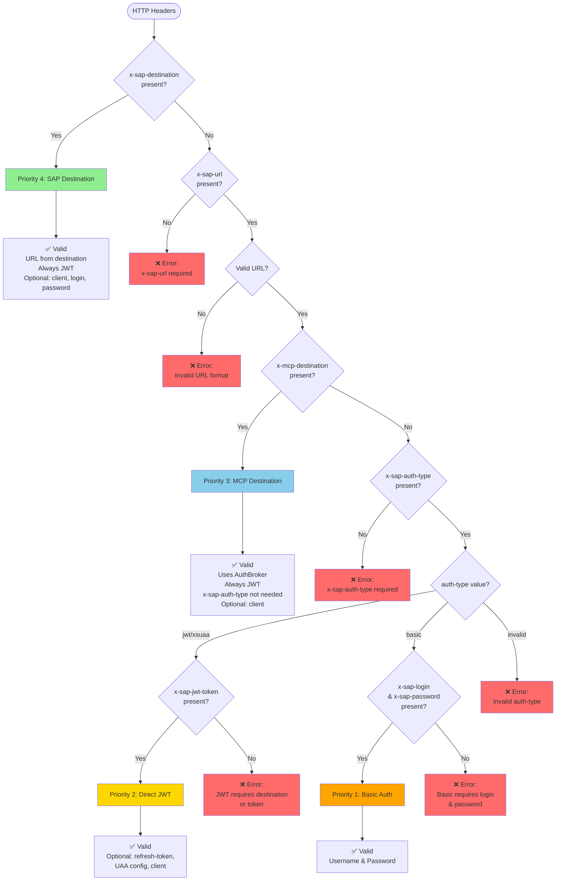

# Header Priority and Composition Diagram

## Priority Flow Diagram



## Header Composition Matrix

| Priority | Method | Required Headers | Optional Headers | URL Source |
|----------|--------|------------------|------------------|------------|
| **4** | SAP Destination | `x-sap-destination` | `x-sap-client`<br/>`x-sap-login`<br/>`x-sap-password` | From destination<br/>(service key/.env) |
| **3** | MCP Destination | `x-sap-url`<br/>`x-mcp-destination` | `x-sap-client` | From header<br/>(`x-sap-url`) |
| **2** | Direct JWT | `x-sap-url`<br/>`x-sap-auth-type: jwt/xsuaa`<br/>`x-sap-jwt-token` | `x-sap-refresh-token`<br/>`x-sap-uaa-url`<br/>`x-sap-uaa-client-id`<br/>`x-sap-uaa-client-secret`<br/>`x-sap-client` | From header<br/>(`x-sap-url`) |
| **1** | Basic | `x-sap-url`<br/>`x-sap-auth-type: basic`<br/>`x-sap-login`<br/>`x-sap-password` | - | From header<br/>(`x-sap-url`) |

## Valid Combinations

### ✅ Valid: SAP Destination (Simplest)

```
x-sap-destination: S4HANA_E19
```
- URL: Loaded from destination service key or .env
- Auth: Always JWT (via AuthBroker)
- Optional: `x-sap-client`, `x-sap-login`, `x-sap-password`

### ✅ Valid: SAP Destination + Optional Headers

```
x-sap-destination: S4HANA_E19
x-sap-client: 100
x-sap-login: user
x-sap-password: pass
```
- URL: From destination
- Auth: JWT via AuthBroker
- Client and credentials: Optional (for cloud systems)

### ✅ Valid: MCP Destination

```
x-sap-url: https://test.sap.com
x-mcp-destination: TRIAL
```
- URL: From `x-sap-url` header
- Auth: Always JWT via AuthBroker (no `x-sap-auth-type` needed)
- Optional: `x-sap-client`
- Note: If `x-sap-auth-type` is provided, it will be ignored (warning issued)

### ✅ Valid: Direct JWT

```
x-sap-url: https://test.sap.com
x-sap-auth-type: jwt
x-sap-jwt-token: eyJhbGciOiJSUzI1NiIsInR5cCI6IkpXVCJ9...
x-sap-refresh-token: refresh_token (optional)
x-sap-uaa-url: https://uaa.test.com (optional)
```
- URL: From `x-sap-url` header
- Auth: Direct JWT token
- Optional: Refresh token, UAA config, client

### ✅ Valid: Basic Auth

```
x-sap-url: https://test.sap.com
x-sap-auth-type: basic
x-sap-login: username
x-sap-password: password
```
- URL: From `x-sap-url` header
- Auth: Username/password

## Priority Resolution Examples

### Example 1: SAP Destination Wins (Highest Priority)

```
Headers:
  x-sap-destination: S4HANA_E19        ← Priority 4 (selected)
  x-sap-url: https://test.sap.com      ← Ignored (warning)
  x-sap-auth-type: jwt                 ← Ignored (warning)
  x-mcp-destination: TRIAL             ← Ignored (warning)
  x-sap-jwt-token: token               ← Ignored (warning)

Result: SAP Destination (Priority 4)
Warnings: 4 (all other headers ignored)
```

### Example 2: MCP Destination Over Direct JWT

```
Headers:
  x-sap-url: https://test.sap.com
  x-mcp-destination: TRIAL             ← Priority 3 (selected)
  x-sap-auth-type: jwt                 ← Ignored (warning, not needed)
  x-sap-jwt-token: token               ← Ignored (warning)

Result: MCP Destination (Priority 3)
Warnings: 2 (x-sap-auth-type and x-sap-jwt-token ignored)
```

### Example 3: Direct JWT Over Basic

```
Headers:
  x-sap-url: https://test.sap.com
  x-sap-auth-type: jwt
  x-sap-jwt-token: token               ← Priority 2 (selected)
  x-sap-login: user                    ← Ignored
  x-sap-password: pass                 ← Ignored

Result: Direct JWT (Priority 2)
```

## Invalid Combinations

### ❌ Missing Required Headers

```
x-sap-url: https://test.sap.com
// Missing x-sap-auth-type or x-sap-destination
```
**Error**: `x-sap-auth-type header is required when x-sap-destination is not present`

### ❌ JWT Without Token or Destination

```
x-sap-url: https://test.sap.com
x-sap-auth-type: jwt
// Missing x-sap-destination, x-mcp-destination, and x-sap-jwt-token
```
**Error**: `JWT authentication requires either x-sap-destination, x-mcp-destination, or x-sap-jwt-token header`

### ❌ Basic Without Credentials

```
x-sap-url: https://test.sap.com
x-sap-auth-type: basic
// Missing x-sap-login and/or x-sap-password
```
**Error**: `Basic authentication requires x-sap-login and x-sap-password headers`

## Decision Tree

```
1. Is x-sap-destination present?
   YES → Use SAP Destination (Priority 4)
        - URL from destination
        - Always JWT
        - Optional: client, login, password
        - Ignore: x-sap-url, x-sap-auth-type, tokens
   
   NO → Continue to step 2

2. Is x-sap-url present?
   NO → Error: x-sap-url required
   
   YES → Continue to step 3

3. Is x-mcp-destination present?
   YES → Use MCP Destination (Priority 3)
        - URL from x-sap-url header
        - Always JWT (no x-sap-auth-type needed)
        - Optional: client
        - Ignore: x-sap-auth-type, tokens
   
   NO → Continue to step 4

4. Is x-sap-auth-type present?
   NO → Error: x-sap-auth-type required
   
   YES → Continue to step 5

5. What is auth-type?
   jwt/xsuaa → Check for token
   basic → Check for login/password
   invalid → Error: invalid auth-type

6. For jwt/xsuaa:
   - Is x-sap-jwt-token present? → Use Direct JWT (Priority 2)
   - Missing? → Error: JWT requires destination or token

7. For basic:
   - Are x-sap-login and x-sap-password present? → Use Basic (Priority 1)
   - Missing? → Error: Basic requires login and password
```

